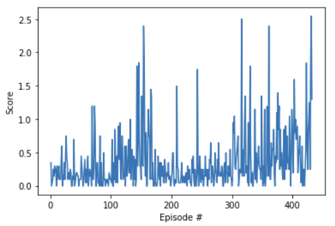

## Learning Algoritm DDPG

I use the DDPG algoritm to train Tennis Agent. 

The DDPG algorithm is a typical Actor-critic approach that addresses DQN's discrete action space through the Actor and the Critical network.

The Actor network receives state as input and outputs the factors for the action.
The Critical Network receives state and action inputs and outputs value functions.

The DDPG algorithm uses Replay Buffer just like DQN, and the Soft update technique is used.

Soft update technique is not to update the Target Network at once after a few steps, but to update the Target slowly through weighting tau.

Tau is usually set to around 0.001, which adjusts the speed of the update.

Agent is implemented in Tennis and Network structure is in model_y.

## Learning Parameter

BATCH_SIZE : 128        # minibatch size

GAMMA : 0.99            # discount factor

TAU : 0.001             # for soft update of target parameters

LR_ACTOR : 0.0001       # learning rate of the actor

LR_CRITIC : 0.0001      # learning rate of the critic

WEIGHT_DECAY : 0        # L2 weight decay

Total Episode : 3000         

## Neural Network Layer

For the neural models:    

 - Actor
 
  - Hidden: (input, 1024) - ReLU
  - Hidden: (1024, 512)   - ReLU
  - Hidden: (512, 256)    - ReLU
  - Hidden: (256, 128)    - ReLU
  - Output: (128, 1)      - TanH

 - Critic
 
  - Hidden: (input, 1024)                - ReLU
  - Hidden: (1024 + action_size , 512)   - ReLU
  - Hidden: (512, 256)                   - ReLU
  - Hidden: (256, 128)                   - ReLU
  - Output: (128, action_size)           - linear

## Reward Graph

## Idea for Furture

you can consider other replay methods, like Prioritized Experience Replay method.

This method is to calculate the importance of the Replay buffer and add weights to the good experence.

you can find references by below links:

A Novel DDPG Method with Prioritized Experience Replay : https://cardwing.github.io/files/DDPG-SMC.pdf

implementation : https://github.com/rlcode/per
